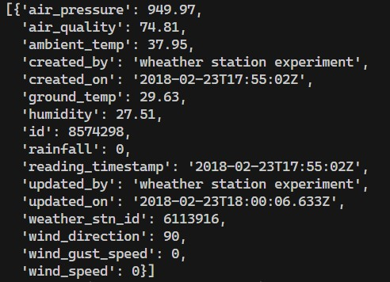

# Projeto 6: Visão Computacional e utilização de APIs

Introdução ao uso de periféricos embarcados na raspberry com o uso do módulo de câmera, além da utilização do versionamento de código via Git/GitHub, e o uso de APIs para obtenção de dados da internet para o desenvolvimento de uma aplicação climática. 

---

## Objetivos

- [x] Utilizar o módulo de câmera da raspberry PI para captura de imagens e vídeos.
- [x] Utilizar o versionamento de código via Git/GitHub.
- [x] Utilizar APIs para obtenção de dados da internet.

## Descrição

Introdução ao uso de periféricos embarcados na raspberry com o uso do módulo de câmera, além da utilização do versionamento de código via Git/GitHub, e o uso de APIs para obtenção de dados da internet para o desenvolvimento de uma aplicação climática. A primeira parte da prática é referente ao uso da camera, enquanto a segunda é a da API climática. 

### Visão Computacional com a RaspCam

Com a camera conectada na raspberry e comunicação I2C habilitada, através do código disponível no arquivo "Pratica6.py" foi possível acessar as imagens da camera. Perceba que foi utilizado a biblioteca PiCamera para esse projeto. O output da camera obtido em laboratório pode ser visualizado abaixo:


Mesmo com a imagem "borrada", é perceptível que o sistema e os códigos funcionam como esperado. 

### API Climática

Obtenção de dados climáticos por meio da API de clima da Oracle, para isso, será utilizado as bibliotecas json e requests. O código completo pode ser encontrado no arquivo "Pratica6.py". A estação mais próxima para obtenção dos dados não fornecia as informações necessárias, por isso, utilizou-se a segunda mais perto, a qual possui dados para serem utilizados. O Output do código pode ser visto abaixo, onde é possível identificar no formato json, os dados obtidos pela API.



## Detalhamento

### Visão Computacional com a RaspCam

Para a utilização da camera, foi necessário a instalação da biblioteca PiCamera, que pode ser feita através do comando:

```bash
sudo apt-get install python-picamera
```

Após a instalação, foi possível utilizar a camera para captura de imagens e vídeos. O código utilizado para a captura de imagens pode ser visto abaixo:

```python
from picamera import PiCamera
from time import sleep

camera = PiCamera()

camera.start_preview()
# Code
sleep(5)
camera.capture('Dados_11800910_11876933.jpg')
camera.stop_preview()
```

O código acima, captura uma imagem e salva com o nome "Dados_11800910_11876933.jpg". Perceba que como ele está atrelado ao tempo, a imagem pode ficar "borrada", como pode ser visto na imagem acima. Além disso, foi selecionada apenas a parte relativa a camera, deixando a lógica da API climática para a próxima seção.

### API Climática

Para a obtenção dos dados climáticos, foi utilizado a API da Oracle, que pode ser acessada através do link: https://weather-ydn-yql.media.yahoo.com/forecastrss. Para a obtenção dos dados, foi necessário a criação de uma conta no site, e a obtenção de uma chave de acesso. A chave de acesso é necessária para a obtenção dos dados, e pode ser obtida através do link: https://developer.yahoo.com/weather/.

Após a obtenção da chave de acesso, foi possível a obtenção dos dados climáticos. O código utilizado para a obtenção dos dados pode ser visto abaixo, dada a latitude e longitude:

```python
import requests
import json

# URL da API do clima
url = "https://weather-ydn-yql.media.yahoo.com/forecastrss"
weather = 'https://apex.oracle.com/pls/apex/raspberrypi/weatherstation/getlatestmeasurements/'

# Coordenadas da minha casa
my_lat = -21.9900598
my_lon = -47.8902261

# Pegando todas as estações
all_stations = get(stations).json()['items']

# Booleano para saber se a estação mais próxima foi achada
station_found = False
```

> Pegando a estação mais próxima

A estação mais próxima pode ser encontrada por meio de uma lógica simples interativa de distância de dois pontos (tendo a latitude e longitude atual). A função abaixo, encontra a estação mais próxima, e retorna o ID da estação. Identificando qual estação está mais próxima, é possível a obtenção dos dados climáticos.

```python
def find_closest():
    '''
    Função para encontrar a estação mais próxima
    '''
    global station_found

    closest_station = all_stations[0]
    closest_distance = abs(my_lat - closest_station['weather_stn_lat']) + abs(
        my_lon - closest_station['weather_stn_long'])
    for station in all_stations:
        distance = abs(my_lat - station['weather_stn_lat']) + \
            abs(my_lon - station['weather_stn_long'])
        # Exclusão da estação que não está funcionando
        if distance < closest_distance and station['weather_stn_id'] != 19760370:
            closest_distance = distance
            closest_station = station
            station_found = True
    return closest_station['weather_stn_id']

closest_station = find_closest()
```

> Pegando os dados da estação mais próxima

Com a estação encontrada, é possível a obtenção de seus dados climáticos pela API. Perceba que a API retorna uma lista de dados, por isso, o código abaixo, percorre a lista e mostra esses dados de umidade e temperatura dentro da imagem do código da camera da seção anterior.

```python
if station_found:
    weather += str(closest_station)
    weather = get(weather).json()['items']
    pprint(weather)

    # Pegando a temperatura e a umidade
    for i in range(5):
        camera.start_preview()
        camera.annotate_text = "Temperatura: " + \
            str(closest_station['ambient_temp']) + "ºC" + \
            "Umidade: " + str(closest_station['humidity']) + "%"
        camera.annotate_text_size = 30
        sleep(5)
        camera.capture('Dados_11800910_11876933.jpg')
        camera.stop_preview()
```

Assim, é possível cumprir todos os requisitos pedidos para a prática de forma plena.